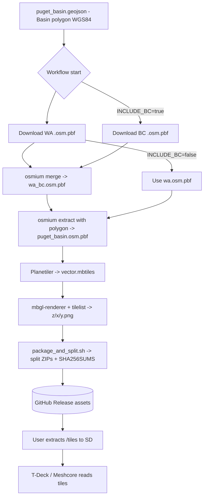

# Puget Mesh — Offline Map Tiles

This repository builds and **publishes split ZIPs of offline raster map tiles** covering the **Puget Sound Basin** for **Meshcore / T-Deck** usage.
Tiles are generated from OpenStreetMap extracts, clipped to the Basin polygon.

---

## Quick start

1. Commit your Basin polygon to `./shapes/puget_basin.geojson`.
   - Format: GeoJSON, WGS84 (EPSG:4326).
   - Shapefile (`.shp` + sidecars) also supported if you prefer, but GeoJSON is leaner.
2. Push this repo to GitHub.
3. Run the **build-tiles** workflow (manually or on schedule).
4. Download split ZIPs from the Release, extract to a microSD so you have `tiles/{z}/{x}/{y}.png` at the SD root.
5. Insert into T-Deck; Meshcore will pick up the `tiles/` folder automatically.

---

## Defaults

- **Area**: Puget Sound Basin polygon from `./shapes/puget_basin.geojson` + the configured buffer.
- **Sources**:
  - OSM extracts from Geofabrik:
    - Washington (always)
    - British Columbia (optional, toggle `INCLUDE_BC=true`)
- **Clipping**: `osmium extract` trims WA+BC to the Basin polygon (`puget_basin.osm.pbf`).
- **Tile builder**: Planetiler → vector MBTiles → raster tiles with `mbgl-renderer`.
- **Zooms**: `z8–12` (regional through city-level).
- **Packaging**: split ZIPs (`zip -s 2000m`) + `SHA256SUMS` → Release assets.

---

## Repository structure

```
.github/workflows/build-tiles.yml   # CI to build & publish releases
scripts/
  fetch_basin_polygon.py            # Load local geometry (default ./shapes/puget_basin.geojson); buffer
  compute_tiles.py                  # Enumerate z/x/y tiles intersecting polygon via mercantile + shapely
  render_raster_tiles.js            # Use @consbio/mbgl-renderer to rasterize listed tiles
  package_and_split.sh              # Create split ZIPs + SHA256SUMS
shapes/
  puget_basin.geojson               # Committed Puget Basin polygon (required)
styles/
  bright-min.json                   # Minimal MapLibre style; points to local vector MBTiles
  topo-major.json                   # Slightly richer style focused on major features
act.inputs                          # Example ACT input file (zoom, style, etc.)
README.md                           # You are here
```

---

## Workflow overview

1. **Load local basin polygon** (`./shapes/puget_basin.geojson`) → `basin.geojson`.
2. **Download OSM extracts** (WA + optional BC).
3. **Merge + clip** with `osmium extract` to produce `puget_basin.osm.pbf`.
4. **Planetiler** converts PBF → `tiles/vector.mbtiles`.
5. **Rasterize** selected tiles → `tiles/{z}/{x}/{y}.png`.
6. **Package** split ZIPs + checksums → uploaded to the Release.

---



---

## Configuration knobs

Override via workflow **inputs** or repository **variables**:

- `ZOOM_MIN` / `ZOOM_MAX` (default: 8 / 12)
- `BASIN_BUFFER_KM` (default: 10)
- `INCLUDE_BC` (default: true)
- `STYLE_JSON` (default: `styles/bright-min.json`)

---

## Run with ACT (local CI)

You can run the same GitHub workflow locally using ACT (Docker required). This is the easiest way to exercise the full pipeline end‑to‑end without pushing to GitHub.

Prerequisites:

- Docker running
- ACT installed (`brew install act` on macOS)

Option A — use the provided inputs file:

```cli
act workflow_dispatch \
  -W .github/workflows/build-tiles.yml \
  -j build \
  --input-file act.inputs \
  -P ubuntu-22.04=catthehacker/ubuntu:act-22.04 \
  --artifact-server-path .artifacts
```

Edit `act.inputs` to tweak zooms, buffer distance, or style.

Option B — specify inputs inline:

```cli
act workflow_dispatch \
  -W .github/workflows/build-tiles.yml \
  -j build \
  --input zoom_min=8 \
  --input zoom_max=12 \
  --input include_bc=false \
  --input basin_buffer_km=10 \
  --input style_json=styles/bright-min.json \
  -P ubuntu-22.04=catthehacker/ubuntu:act-22.04 \
  --artifact-server-path .artifacts
```

Notes:

- Outputs are written to `RELEASE_ASSETS/puget-mesh-tiles/` in your workspace; the `--artifact-server-path` also captures uploaded artifacts under `.artifacts/`.
- On Apple Silicon, add `--container-architecture linux/amd64` if you hit image compatibility issues.
- The release step runs only for tag refs; when testing locally, you can ignore it or pass `-s GITHUB_TOKEN=<token>` if you want to exercise it.
- Use `act -l` to list workflows and `act -n` for a dry run.

---

## Local testing (optional)

Dependencies: Python 3.10+, Node 18+, Java 21+, osmium-tool.

On Linux for raster rendering, install headless OpenGL libs:

```bash
sudo apt-get update
sudo apt-get install -y libopengl0 libgl1 libglu1-mesa libosmesa6
export LIBGL_ALWAYS_SOFTWARE=1
```

Example run:

```bash
# 1. Ensure you have ./shapes/puget_basin.geojson committed.
python3 scripts/fetch_basin_polygon.py --local ./shapes/puget_basin.geojson --out basin.geojson --buffer-km 10

# 2. Download WA/BC and clip with osmium
curl -L -o data/wa.osm.pbf https://download.geofabrik.de/north-america/us/washington-latest.osm.pbf
curl -L -o data/bc.osm.pbf https://download.geofabrik.de/north-america/canada/british-columbia-latest.osm.pbf
osmium merge data/wa.osm.pbf data/bc.osm.pbf -o data/wa_bc.osm.pbf
osmium extract --polygon ./shapes/puget_basin.geojson --strategy=complete_ways -o data/puget_basin.osm.pbf data/wa_bc.osm.pbf

# 3. Build vector tiles
java -Xmx8g -jar planetiler.jar --download=true --osm-path=data/puget_basin.osm.pbf --output=tiles/vector.mbtiles --min-zoom=8 --max-zoom=12 --bounds-file=basin.geojson

# 4. Compute tile list
python3 scripts/compute_tiles.py --geom basin.geojson --zmin 8 --zmax 12 --prefix tilelist

# 5. Rasterize tiles
node scripts/render_raster_tiles.js --style styles/bright-min.json --mbtiles tiles/vector.mbtiles --tilelist tilelist_all.txt --outdir tiles

# 6. Package
bash scripts/package_and_split.sh tiles RELEASE_ASSETS/test

```

---

## Notes

- **First pipeline run** can take a while on GitHub-hosted runners, especially at higher zooms.
- If you need `z13–14` or cross-border coverage, consider a **self-hosted runner** with more CPU/RAM and a longer timeout.
- The provided style is intentionally minimal; you may swap it for a richer OpenMapTiles-compatible style once you validate the flow.

---

## Quick viewer (Leaflet)

To preview your rendered raster tiles like an app:

1. Ensure you have `tiles/{z}/{x}/{y}.png` in the repo (either built locally or extracted from a Release).
2. Start a local server at the repo root:

   ```bash
   python3 -m http.server 8000
   ```

3. Open the viewer in a browser: `http://localhost:8000/viewer/`.

Notes:

- The viewer targets `tiles/` relative to the repo root and will try to fit to `basin.geojson` (or fallback to `shapes/puget_basin.geojson`).
- Leaflet uses Web Mercator (EPSG:3857), which matches the raster tile pyramid here.
- Adjust min/max zoom in the small control panel to match the zooms you rendered (defaults to 8–12).
